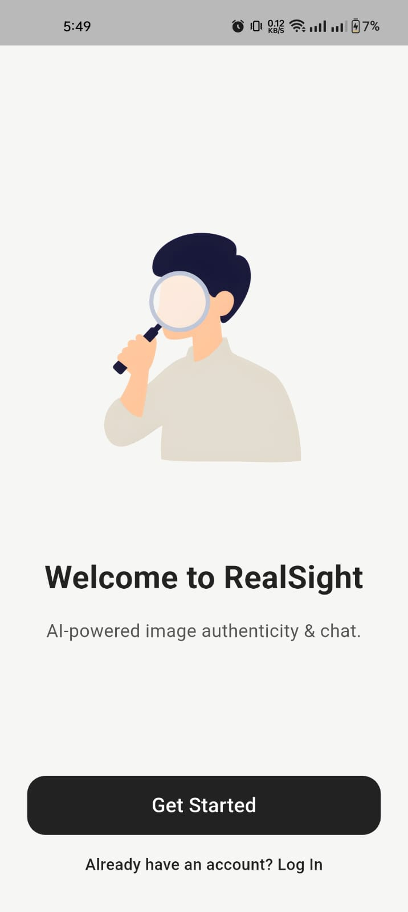
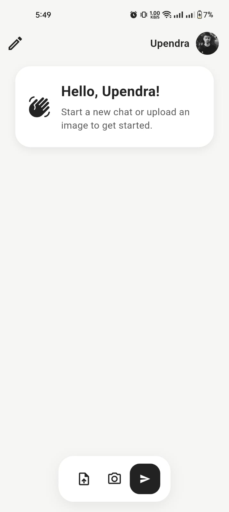
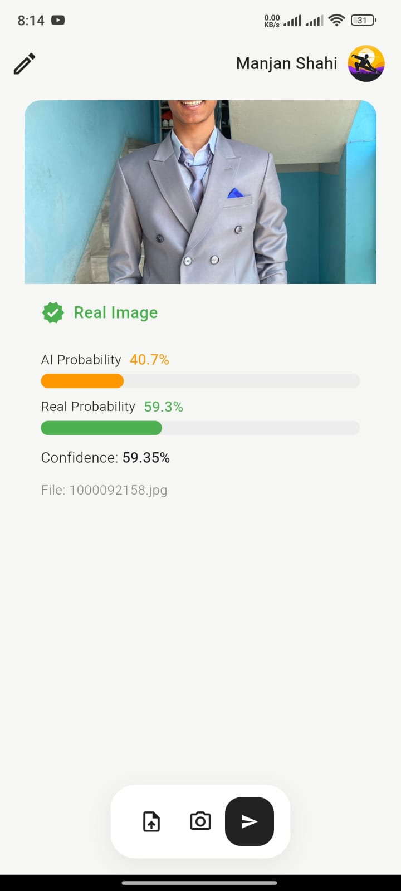

**Real Sight** is an intelligent Flutter app that lets users upload or capture an image, and then uses a machine learning model to detect whether the image is real or AI-generated.

---

## ℹ️ About

Real Sight empowers users to:
- Upload or capture images directly from their device.
- Instantly analyze images using advanced AI to determine if they are authentic or generated by artificial intelligence.
- Get clear, user-friendly results and feedback.

Whether you're curious about the authenticity of an image or want to explore the power of AI detection, Real Sight provides a seamless and intuitive experience.

---

## 🚀 Features
- **AI Image Detection:** Instantly detect if an image is real or AI-generated.
- **Image Upload & Capture:** Choose images from your gallery or use your camera.
- **Cross-platform:** Works on Android, iOS, Web, and Desktop.
- **Firebase Integration:** Secure authentication and cloud features.
- **User Profile & Dashboard:** Manage your account and view detection history.
- **Modern, Intuitive UI:** Clean design for a smooth user experience.

---

## 📸 App Showcase
| Screenshot 1 | Screenshot 2 | Screenshot 3 |
|:---:|:---:|:---:|
| | ||

---

## 🛠️ Getting Started

1. **Clone the repository:**
   ```bash
   git clone <repo-url>
   cd realsightapp
   ```
2. **Install dependencies:**
   ```bash
   flutter pub get
   ```
3. **Run the app:**
   ```bash
   flutter run
   ```

---

## 📂 Project Structure

- `lib/` - Main Dart source code
- `assets/` - App images and illustrations
- `android/`, `ios/`, `web/`, `macos/`, `windows/`, `linux/` - Platform-specific code

---

## 🤝 Contributing

Contributions are welcome! Please open issues and submit pull requests.

---

## 📄 License

This project is licensed under the MIT License.
